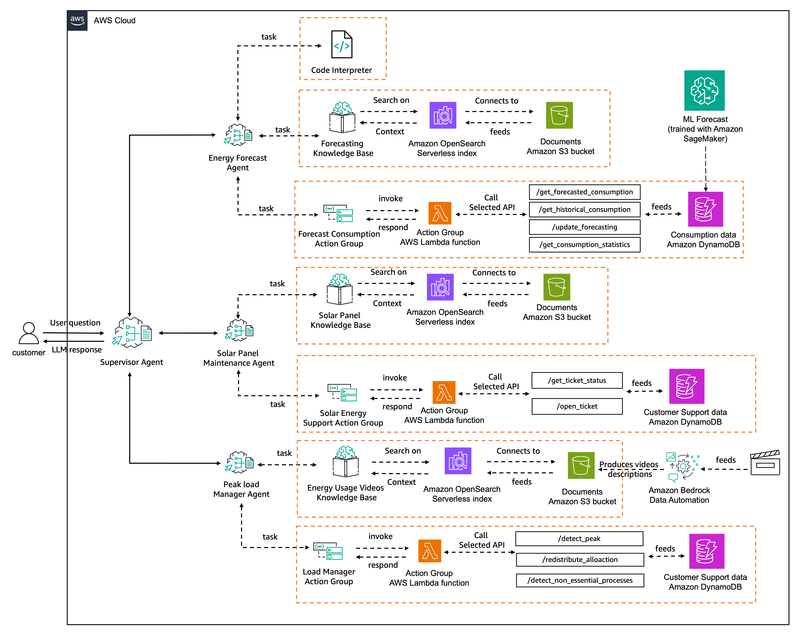

AWS services available:
- Strands Agents: simple-to-use framework for building agents
- Bedrock AgentCode Runtime: serverless session-isolated envs supporting any agent framework
- AgentCode Memory: manages session and long-term memory
- [Bedrock Multi-Agent Workshop](https://github.com/aws-samples/bedrock-multi-agents-collaboration-workshop)
    - 
- 